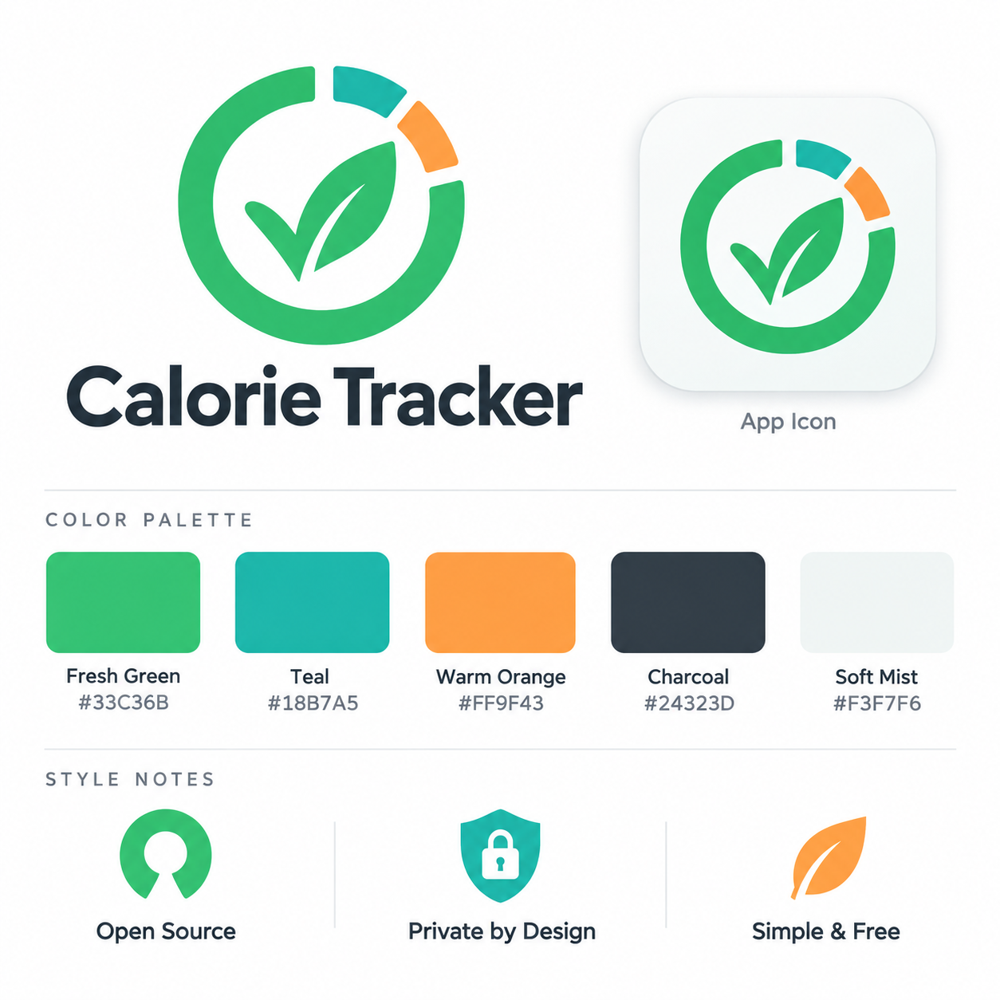

# Calorie Tracker design system

This is the reference for every visual decision in the app, the store listings and anything else that carries the brand. It was extracted from the brand sheet ([brand/brand-sheet.png](brand/brand-sheet.png)) and the logo lockup ([brand/lockup.png](brand/lockup.png)) on 2026-09-18. When a design question comes up, answer it from here. When the answer is not here, decide, then write it down here in the same change.

The values live in code in [`src/ui/theme.ts`](../../src/ui/theme.ts), the components in [`src/ui/kit.tsx`](../../src/ui/kit.tsx). Screens use those and never a raw colour, font size or stock `Button`. `src/ui/theme.test.ts` fails the build if a text pairing drops below WCAG AA.

## What the brand says

The sheet's three style notes are the product's promises, and the interface has to look like them:

- **Open source.** Nothing hidden: plain labels, no dark patterns, no upsell surfaces.
- **Private by design.** Calm and trustworthy. Say where data goes at the moment it goes anywhere ("Sends only the barcode").
- **Simple and free.** One obvious action per screen. Generous space, few colours, no decoration that carries no information.

The mark is a daily progress ring closing around a leaf that is also a tick: progress, health, done. The ring is mostly green with a teal and an orange segment, which is where the three accent colours and their order of importance come from.

## Colour

### Brand palette

These five are canonical, exactly as labelled on the sheet. The logo raster renders them a shade differently (green `#22C86F`, teal `#07BBB1`, orange `#FD9A35`, charcoal `#1A2730`); use the labelled values for everything except the logo image itself.

| Name | Hex | Role |
|---|---|---|
| Fresh Green | `#33C36B` | Primary. The main action on a screen, progress toward a goal, the selected state. |
| Teal | `#18B7A5` | Secondary accent. Informational and privacy cues. Use sparingly; never for a primary action. |
| Warm Orange | `#FF9F43` | Attention. A goal reached or passed, a banner that wants a tap. Not an error. |
| Charcoal | `#24323D` | All text, icons on light surfaces, the undo toast. |
| Soft Mist | `#F3F7F6` | The app background, the icon tile, the splash. |

Proportions follow the mark: mostly mist and white glass, green for what matters, teal and orange as small accents. A screen with more than one orange element or more than one filled green button is wrong.

### Derived colours

The brand hues are too light to be text on a light surface, and the palette has no red. These were derived to fill those gaps and are the only additions allowed without updating this document.

| Token | Value | Why it exists |
|---|---|---|
| `textMuted` | `#52606B` | Secondary text. Charcoal lightened; 6.0:1 on mist so it still passes on the tinted backdrop. |
| `greenDeep` | `#15713C` | Green as text or icon: links, plain and tinted buttons, the selected tab. |
| `tealDeep` | `#0E7C70` | Teal as text. |
| `danger` | `#B42D33` | Destructive actions and error messages only. |
| `greenTint`, `dangerTint` | 14% green, 12% danger | Fills for tinted and destructive buttons and the selected tab. |
| `frost`, `chrome`, `edge`, `field`, `track`, `switchOff`, `scrim` | white or charcoal at an alpha | The glass materials below. |

### Contrast

Measured WCAG 2 ratios; AA for body text is 4.5:1. The test file keeps these true.

| Pairing | Ratio | |
|---|---|---|
| Charcoal on Soft Mist | 12.2 | pass |
| `textMuted` on Soft Mist | 6.0 | pass |
| `greenDeep` on Soft Mist / on a tinted button | 5.6 / 5.1 | pass |
| `tealDeep` on Soft Mist | 4.7 | pass |
| `danger` on Soft Mist / on a destructive button | 5.8 / 4.8 | pass |
| Charcoal on Fresh Green / Teal / Warm Orange | 5.7 / 5.2 / 6.4 | pass |
| White on `danger` / on Charcoal | 6.2 / 13.1 | pass |
| Fresh Green on Charcoal (the toast's Undo) | 5.7 | pass |
| **White on Fresh Green** | **2.3** | **fail** |
| Fresh Green, Teal or Warm Orange as text on a light surface | 2.1 / 2.3 / 1.9 | fail |

Two rules fall out of that table and are the ones most likely to be broken by accident:

1. **A green button carries a charcoal label, never white.**
2. **The three bright hues are fills, never text.** Text in a brand colour uses the deep cut.

### What each colour means

- Green bar or ring: working toward the goal. Orange: reached or passed it. There is no red in nutrition; going over a goal is information, not a failure.
- Red appears only on delete, replace and error text.
- Dark mode is not designed yet (`userInterfaceStyle` is `light`). When it is, it gets its own section here first; do not invert colours ad hoc.

## Glass

The look is modern iOS: bright translucent surfaces with a lit rim, floating over a soft coloured backdrop. There are exactly two materials, and the split follows Apple's own rule that glass is for the control layer, not for content.

**Backdrop.** Soft Mist with the three brand hues glowing in from the corners (green top left at 20%, teal top right at 16%, orange bottom right at 13%, each fading to nothing). It is what makes translucent surfaces read as glass, so every screen draws it, through `Screen`. It is built with React Native's own `experimental_backgroundImage` radial gradients; no gradient library.

**Frost: content surfaces.** `Card`, `Section`, `Banner`. White at 62%, a 1px white rim at 90%, 24pt corners, a soft wide shadow (`0 8 24` charcoal at 8%). Everything the user reads or edits sits on frost.

**Chrome: floating controls.** `Glass`: the tab bar, round header buttons, the scan hint and the scan result sheet. On iOS 26 and later it is the system's real Liquid Glass (`expo-glass-effect`). Everywhere else, including all of Android, it is white at 94% with the same rim and a stronger shadow (`0 12 32` at 18%). It is nearly opaque on purpose: without a real blur, text scrolling underneath a more transparent bar collides with the tab labels. Do not add a blur library to chase the iOS look on Android.

The toast is the one dark surface: a charcoal pill with white text and a Fresh Green action.

## Shape, space and type

- **Corners:** 24 for cards and sheets, 14 for fields and banners, fully round for buttons, chips, the tab bar and icon buttons.
- **Space:** a 4pt grid. 16 at the screen edge and inside cards, 14 between cards, 8 to 10 between rows.
- **Touch targets:** 48pt for buttons and rows, 44pt minimum for anything tappable. Small buttons are 36pt tall with `hitSlop` making up the difference.
- **Type:** the system font (San Francisco on iOS, Roboto on Android), so the app feels native and ships no font files. The scale follows the iOS text styles:

| Style | Size / weight | Use |
|---|---|---|
| `largeTitle` | 34 bold | Tab screen titles |
| `title` | 22 bold | Stack screen titles, the app name |
| `headline` | 17 semibold | Meal names, sheet headings |
| `body` | 16 | Everything else |
| `muted` | 14, `textMuted` | Secondary lines, hints |
| `caption` | 12 semibold, uppercase, tracked | Section labels above a card |
| `link` | 16 semibold, `greenDeep` | Links and text actions |
| `error` | 14, `danger` | Validation and failure messages |

Numbers that change or line up in a column use `fontVariant: ['tabular-nums']`.

## Components

All in `src/ui/kit.tsx` unless noted. Add a component there when a pattern appears a second time, not before.

| Component | What it is |
|---|---|
| `Screen` | Every screen's root: backdrop, safe areas, header. `tab` screens get a large title and leave room for the tab bar; stack screens get a round glass back button and a `title`. Native navigation headers are off everywhere. |
| `useInsets` | Safe-area insets for anything positioned by hand (the scan overlays). Use it instead of `useSafeAreaInsets` for the top edge: Android has reported a top inset of 0 on a first launch, and this never goes below the status bar height. |
| `Card`, `Section` | Frost surface; `Section` adds the uppercase caption above it (the iOS grouped list). |
| `Glass` | Chrome surface. |
| `Btn` | `primary` (green fill, charcoal label: one per screen), `tinted` (the default), `plain` (text only), `destructive` (red tint: the first tap on a delete), `danger` (solid red: the armed second tap). `small` for inline actions. |
| `IconBtn` | 40pt round glass button; always takes an accessibility `label`. |
| `Field` | Text input on a bright translucent fill. |
| `Chips` (`Chips.tsx`) | Single choice; selected is a green fill with a bold charcoal label. |
| `Ring` | The brand mark's progress ring, used for energy on Today. Green until the goal, orange from 100%. |
| `NutrientBar` (`NutrientBar.tsx`) | 8pt progress bar with the same green-then-orange rule. |
| `Line` | Label left, value right. Nutrition facts and summaries. |
| `Banner` | A frost row with a round colour badge: orange for "worth a tap", red for a failure. The colour stays in the badge so the text sits on a clean surface. |
| `Icon` | SF Symbols on iOS, Material Symbols on Android, through `expo-symbols`. Add a name pair to the `ICONS` table rather than naming symbols in a screen. Icons are decorative and hidden from screen readers; the control around them carries the label. |
| `Logo` | The mark, from `assets/logo.png`. |
| Tab bar (`app/(tabs)/_layout.tsx`) | A floating chrome pill; the selected tab is a green-tinted pill with `greenDeep` ink. |

Destructive actions are never a dialog: the first tap arms the button ("Tap again to delete"), the second acts. Deleting a diary entry is a long-press followed by an undo toast.

## App icon and logo

`brand/lockup.png` is the source: the mark with the wordmark beneath it, on transparency. Everything else is cut from it by [`scripts/make-icons.py`](../../scripts/make-icons.py) (needs Pillow and numpy); rerun it if the lockup ever changes, and never hand-edit the outputs.

| File | What | Notes |
|---|---|---|
| `assets/icon.png` | 1024, opaque | iOS and the default. The mark at 68% on a tile that eases from white to Soft Mist, as on the brand sheet. The OS rounds the corners. |
| `assets/android-icon-foreground.png` | 1024, transparent | The mark at 48% of the canvas, inside Android's 66dp safe circle so no launcher mask clips the ring. |
| `assets/android-icon-background.png` | 1024 | The same white-to-mist tile. |
| `assets/android-icon-monochrome.png` | 1024, alpha only | The mark's silhouette for Android themed icons. |
| `assets/splash-icon.png` | 1024, transparent | The mark at 62% on Soft Mist, shown 200dp wide. `app/_layout.tsx` holds the splash until the databases are open, so the mark is the loading screen. |
| `assets/logo.png` | 384, transparent | The mark in the app (About). |
| `assets/favicon.png` | 48 | Web. |
| `brand/play-icon-512.png` | 512, opaque | Upload to the Play Console listing. The App Store takes its icon from the build. |

Using the mark:

- The launcher and store icons are the mark alone. The wordmark never goes inside an icon.
- The wordmark is "Calorie Tracker" in a bold geometric sans, Charcoal, beneath or beside the mark. In the app it is set in the system font at `title`; do not embed the lockup image in a screen.
- Keep clear space of a quarter of the mark's width around it. Do not recolour it, put it on a busy photo, or place it on green, teal or orange. Soft Mist, white and Charcoal are the approved grounds.

## Checklist for a new screen

1. Root is `Screen`; content is grouped into `Section`s or `Card`s.
2. At most one `primary` button; nothing else is filled green.
3. No hex values, font sizes or `react-native` `Button` in the screen file.
4. Every tappable thing is at least 44pt and has a label a screen reader can speak.
5. Any new text-on-colour pairing is added to `src/ui/theme.test.ts`.
6. Checked on a phone at the default font size and with the largest system font.
